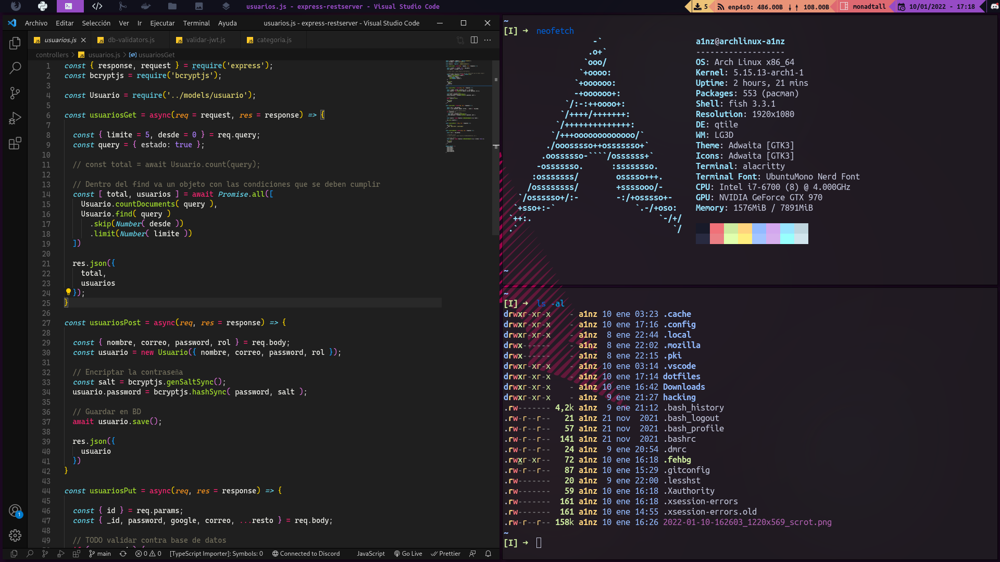

# A1nz's dotfiles 

## List of apps and other software

- [Qtile](http://docs.qtile.org/en/stable/)
- [Alacritty](https://wiki.archlinux.org/title/Alacritty)
- [Rofi](https://github.com/A1nz2802/dotfiles/tree/main/.config/rofi)
- [Vscode](https://aur.archlinux.org/packages/visual-studio-code-bin)
- Neovim
- [Scrot](https://en.wikipedia.org/wiki/Scrot)
- [Fish](https://fishshell.com/docs/current/)
- [Picom](https://wiki.archlinux.org/title/Picom)
- [Feh](https://wiki.archlinux.org/title/feh)
- [Lightdm Glorious Theme](https://github.com/thegamerhat/lightdm-glorious-webkit2)

### Resources

- [Antonio sarosi Dotfiles](https://github.com/antoniosarosi/dotfiles)
- [Derek Taylor Dotfiles](https://gitlab.com/dwt1/dotfiles/-/tree/master/)
- [Instalation guide archlinux](https://www.youtube.com/watch?v=JDLFAjX3yfc&t=812s)
- [Win 10 + Archlinux dualboot](https://www.youtube.com/watch?v=pd1hgF4p8gw&t=1350s)

